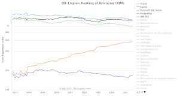
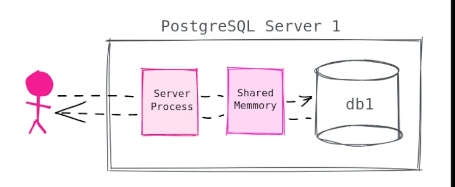

# PostgreSQL Overview

## Info
- Criado em 1986
- Crescendo em popularidade

- <b>psql</b> é a CLI para interagir com o SGBD
- bom para saber os comandos pois ele tem auto complete

## Basic Architecture and Terminology
- <b>Cluster</b>: é um postgres em um server, onde temos usuários permissões
- <b>Database</b>:  é o armazenamento onde o seu arquivo estará com tabelas e indicies
- <b>User</b>: quem vai interagir e possui permissões
- o PostgreSQL utiliza um arquitetura do tipo <b>Client-Server</b>  onde o cliente estabelece sua conexão com o servidor de banco de dados

- Ele armazena suas conexões no server process para sua sessões para cada conexão, é possível ver isso com `show max_connections`
- Postgres não vem com um pool de connections por default, você pode utilizar o <b>PgBouncer</b>
A memória no PostgreSQL pode ser dividido em duas categorias, <b>Shared Memory</b> e <b>Local Memory</b>
- <b>Local</b>: Usado para um unico usuario
- <b>Shared</b>: Compartilhado com todos server process
- <b>Memory: Shared Buffers</b>: um dos topicos mais importantes do postgres, ele mantem uns dados na memoria para busca rapidas, por default é 128MB, é possivel ver ele pelo comando `show shared_buffers`. Resumindo um "Cache", um exemplo é quando voce executa a query segunda vez e vai muito mais rapido
- <b>Local Memory</b>: é alocado para cada server process, ele tem algumas areas como `work_mem` que é usado para sort e hash table (default 1MB), a segunda area é a `temp_buffers` onde armazena tabelas temporarias (default 8MB) e a terceira area é a `maintenance_work_mem` onde fica o [vacuum](https://www.postgresql.org/docs/current/sql-vacuum.html) e operacões de criação de indicies. 
- <b>WAL: Write Ahead Log</b> é um log de todas as mudanças de tabelas e indicies, ela é usada em caso de desastres com o banco de dados, mas tambem uma forma de voce replicar os dados para suas replicas. Após configurar o servidor das replicas em seus arquivos de configuração ele envia via TCP o WAL para as replicas. Replicações podem ser assincronas e sincronas (com locks de recurso até a confirmação da replicação), e podemos ter replicações logicas.