# PostgreSQL Beyond Basic

- Esse documento é mais recomendado para quem quer saber um pouco mais sobre esse banco de dados passando por alguns topicos mais avançados, mas mantendo sempre facil para todos entender :D

## Overview
- Criado em 1986
- Crescendo em popularidade

- <b>psql</b> é a CLI para interagir com o SGBD
- bom para saber os comandos pois ele tem auto complete

## Basic Architecture and Terminology
- <b>Cluster</b>: é um postgres em um server, onde temos usuários permissões
- <b>Database</b>:  é o armazenamento onde o seu arquivo estará com tabelas e indicies
- <b>User</b>: quem vai interagir e possui permissões
- o PostgreSQL utiliza um arquitetura do tipo <b>Client-Server</b>  onde o cliente estabelece sua conexão com o servidor de banco de dados

- Ele armazena suas conexões no server process para sua sessões para cada conexão, é possível ver isso com `show max_connections`
- Postgres não vem com um pool de connections por default, você pode utilizar o <b>PgBouncer</b>
A memória no PostgreSQL pode ser dividido em duas categorias, <b>Shared Memory</b> e <b>Local Memory</b>
- <b>Local</b>: Usado para um unico usuario
- <b>Shared</b>: Compartilhado com todos server process
- <b>Memory: Shared Buffers</b>: um dos topicos mais importantes do postgres, ele mantem uns dados na memoria para busca rapidas, por default é 128MB, é possivel ver ele pelo comando `show shared_buffers`. Resumindo um "Cache", um exemplo é quando voce executa a query segunda vez e vai muito mais rapido
- <b>Local Memory</b>: é alocado para cada server process, ele tem algumas areas como `work_mem` que é usado para sort e hash table (default 1MB), a segunda area é a `temp_buffers` onde armazena tabelas temporarias (default 8MB) e a terceira area é a `maintenance_work_mem` onde fica o [vacuum](https://www.postgresql.org/docs/current/sql-vacuum.html) e operacões de criação de indicies. 
- <b>WAL: Write Ahead Log</b> é um log de todas as mudanças de tabelas e indicies, ela é usada em caso de desastres com o banco de dados, mas tambem uma forma de voce replicar os dados para suas replicas. Após configurar o servidor das replicas em seus arquivos de configuração ele envia via TCP o WAL para as replicas. Replicações podem ser assincronas e sincronas (com locks de recurso até a confirmação da replicação), e podemos ter replicações logicas.

## Common Administrative Tasks

### Manage Tables

- `IF EXISTS OR NOT EXISTS` é sempre bom para evitar erros
- podemos usar `CREATE UNLOGGED TABLE ...` para criar dados que não vão ser enviados para o WAF
    - as coisas podem ficar mais rapidas por conta da sincronização de replicas, mas como auto-explicativo, o dado não vai ser replicado
- `CREATE VIEW ...` é basicamente uma query com um nome, os resultados não são materializados
    - depois elas são acessadas via query normalmente
- `\d+` para inspecionar as tabelas com o psql

### Schemas

- <b>schemas</b> são basicamente namespaces dentro de um banco de dados, o default é chamado de `public`. Voce pode ter tabelas,views diferentes para cada schema
- <b>database objects</b> são basicamente tabelas, views, sequences e por ai vai...
- <b>search path</b> é uma lista de schemas que o banco de dados vai procurar data objects que não foram referenciados na query por um schema, por exemplo `SELECT * FROM xpto` ele vai usar o search path para saber qual schema esta essa tabela xpto
- schemas podem ser uteis para multi-tenancy users (separar cada ambiente pra cada cliente), mas voce pode ter overhead para manter isso
- o schema `pg_catalog` possui varias tabelas e algumas delas são muito importante para ate conseguir retirar metricas do seu banco de dados, alguns exemplos:
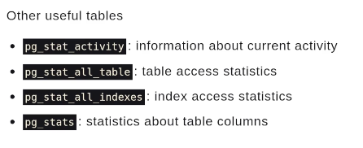

### Data Integrity

- postgres podem ter tipos de dados comuns e dados especiais

- Comuns:

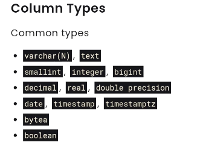

- Especiais:

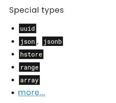

- saber quais dados voce vai salvar é super importante tanto para saber a quantidade de dados que voce vai salvar, por exemplo 10GB por dia (pode ser ate requisito de System Design Interview)
- quanto para evitar erros basicos de tipos
- utilizar `NOT NULL` constraint para colocar dados obrigatorios
- utitlizar <b>unique constraint</b> para dados que não podem ser duplicados, o Postgres cria por baixo dos panos um b-tree index para verificar se essa unique constraint ja existe em outro lugar
- um comando de exemplo `ALTER TABLE users ADD CONSTRAINT users_name_uk UNIQUE(name);`

### Users and Privileges

- Um bom caso de uso para privileges é criar privileges para cada replicas caso voce queira replicas read-only ou replicas com read-write
- é possivel restringindo aquele usuario de comandos de escrita
- <b>role</b> é um jeito de agrupar os usuarios, e poder ter priveleges para essa role por exemplo
- é possivel dar permissões com o comando `GRANT`

## Query Optimization with Indexes

### The path of a Query

- Os passos para executar uma query são: <b>connection, parser, rewrite system, planner/optimizer e executor</b>

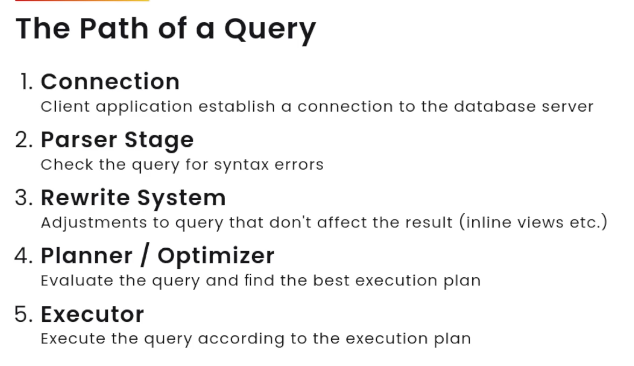

- Dando um zoom in no <b>Query Optimizer</b>
    - o postgres usa um cost base optimize que gera todos os tipos de planos de execução, por exemplo, um usa um index e outro não
    - o proximo passo é estimar o quanto vai custar cada plano de execução, os custos são analisados por unidades abrirtarias, os custos são os recursos como CPU, MEM e IO. Principalmente IO que é a busca no disco que é muito custosa
    - o proximo passo é utilizar o custo mais barato
- Alguns outros bancos podem utilizar outros tipos de otimizadores, alguns exemplos: 

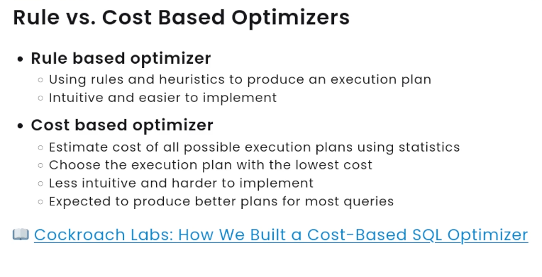

- Agora dando um zoom in no <b>Exectution Plan</b>
- Se queremos saber um plano de execução de uma query, podemos utilizar o comando `EXPLAIN` e ele retorna o QUERY PLAN, o caminho que a query ira fazer
- Nesse exemplo podemos ver o retorno `Seq Scan on` onde o banco de dados diz vai fazer uma busca sequencia naquela tabela

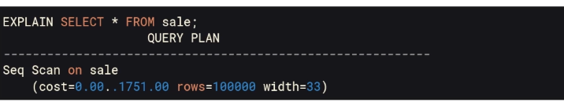

- Ja nesse outro exemplo podemos ver uma busca `Idenx Scan using sale_pkey` que é uma busca indexada direto na chave primaria

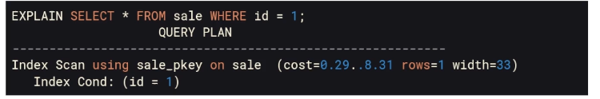

- O banco de dados pode utilizar um sequencia scan caso o seu index for ineficiente
- Utilizando `EXPLAIN (ANALYZE ON, TIMING ON)` para retornar o EXPLAIN e a QUERY e com isso ter dois tempos do optimizar e o tempo de execução da query

### B-Tree Index

- B-Tree funciona de uma modo onde tem uma arvore de poucas folhas onde os dados estão ordenados, ou seja, uma busca em um conjuto de dados ordenados. Por exemplo:

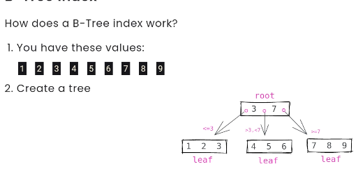

- Criar indicies com `USING btree()` pode ajudam muito no tempo de execução da query
- podemos ter tambem partial index que são geralmente de tamanho menores e podem ter tempo de execução menor tambem. Exemplo

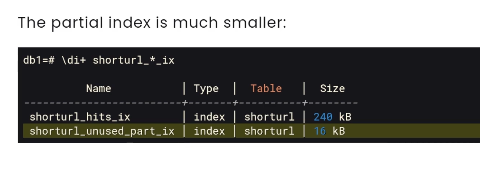

- Voce pode criar dados adicionais um folhas dentro desses indexes, criando indicies inclusivos com `UNIQUE INDEX` e `INCLUDE (id)`
- isso pode fazer o banco buscar o dado somente no indicie, sem ir busca na tabela sem um `Index Only Scan` pois o dado ja vai estar la. Ele pode ter varias vantagens de deixar mais rapidos, mas pode deixar os indicies MUITO grande
- Outro tipo de indicie é function based index, onde podemos ter resultado de função indexados, por exemplo `ON shorturl substring(url FROM '.+://([*/]+)')` nesse caso estamos indexando o resultado dessa substrings
- e por ultimo temos o compiste index, que cria indicies de varios campos. Um ponto importante em indicies composto é que a ordem dos campos é importante,coloque a coluna que tem mais valores comuns primeiro e depois as colunas que tem menos valores depois
- Campos `NULL` são indexados no Postgres por default

### Hash Index

- A performance em banco de dados podemos ter isso balancenado nossos recursos de um jeito melhor
- o tamanho das tabelas e do indicies podem estar diretamente relacionado com isso
- para aplicar um index hash, vamos primeira gerar o hash de cada valor da nossa tabela podendo usar a função `hashchar(value)` e tendo algo semelhante a:

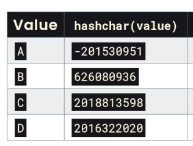

- com isso é possivel agregar esses hash em buckets com `mod(n)` sendo n numero de buckets
- e parar recuperar seria algo relacionado:

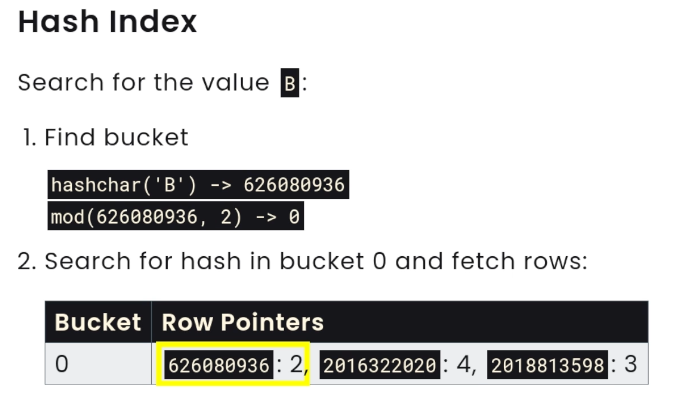

- o tamanho do index usando hash index podem ser mais uteis tambem por não serem afetados pelo tamanho dos valores nas tabelas

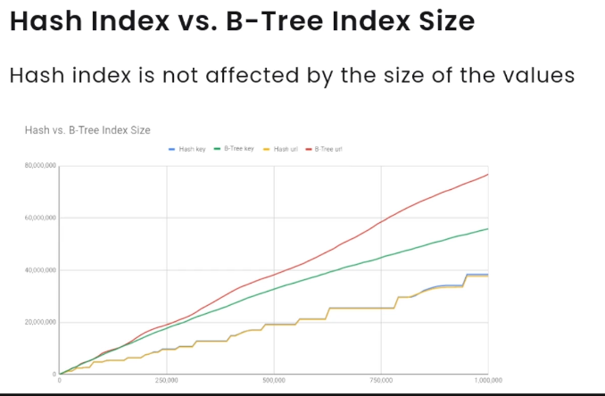

- hash index são otimos para valores que são quase identicos, pois ai eles ficam em buckets distintos, ai facilita para as buiscas

### BRIN (Block Range Index) Index

- O brin funcionado agrupando dados em range como no exemplo:

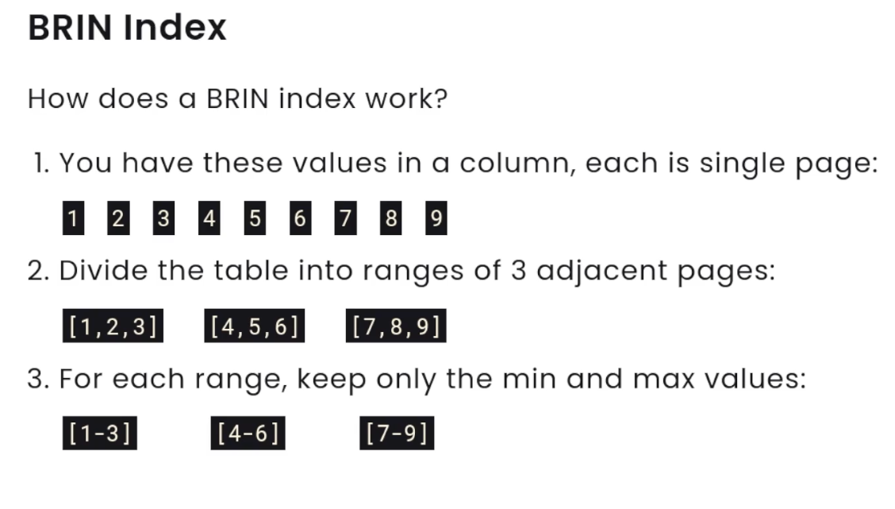

- Para buscar o numero 5, ele so vai scan o block [4-6] e eliminando grande parte dos dados para a busca
- o tamanho de brin index é bem menor que um index de b-tree
- esse index é util so para quando os dados estão com grandes coesão
- é possivel usar bloom filter para dados com grandes coesão

### Indexes Maintence and Best Pratices

- Um index nem sempre é o melhor caminho, se o SGDB ver que com o index ele vai ler uma grande porção de dados, ele vai utilizar um full scan
- Index consome espaço em disco e pode deixar o tempo de `INSERT`, `DELETE` e `UPDATE` menor. Quanto mais index mais demorado essas operações podem ser
- é possivel ver com `SELECT * FROM pg_stat_all_indexes WHERE indexrelname = 'seu_index'` o numero de query que estão utilizando seu indicie
- quando uma linha é deletada ou dado um update, ela basicamente não é "permanentemente exlcuida", ela só é marcada para não ser mais utilizada e ficando como uma "linha morta"
- por isso é muito comum usar `vacuum` para deixar essas linhas mortas prontas para receber novos dados, voce pode manualmente usar vacuum em uma tabela `VACUUM tabela_xpto` ou deixar um `autovacuum`